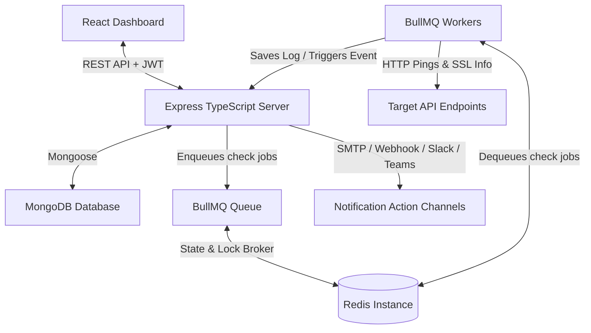

# API Monitor Project Progress Report & Feature Roadmap

This report reviews the current implementation status of the API Monitoring, Logging, and Automation platform and lists high-value feature recommendations to elevate it to a production-grade SaaS application.

---

## 1. Current Application Progress

The application currently has a solid foundation for both backend services and frontend interfaces:

### Backend Capabilities (Built & Verified)
*   **Authentication & Auth Middleware**: Full register/login flow using JWT, Bearer token extraction, and workspace verification rules.
*   **Multi-Tenant Workspaces (RBAC)**: Support for multiple workspaces with isolated monitors, invitations, and roles (`OWNER`, `ADMIN`, `MEMBER`, `VIEWER`).
*   **Monitoring Engine (BullMQ + Redis)**: Queue-based worker process that checks target endpoints at a specified interval with configurable retry limits (`retries`, `retryInterval`).
*   **SSL/TLS Certificate Expiry Checker**: Node `tls` based validation checking issuer, valid-to/from dates, validity, and countdown of days remaining.
*   **Logging & Analytics Layer**: Tracks check logs, logs response times, HTTP status codes, error details, and aggregates analytics like uptime percentage and average latency.
*   **Events & Workflow Engine**: Automatically triggers workflows when check results switch status (e.g. `API_UP`, `API_DOWN`).
*   **Multi-Channel Alerts**: Action execution layer supports **SMTP Email**, **Webhooks**, **Slack Webhooks**, and **Microsoft Teams cards**.

### Frontend UI Capabilities (Built & Verified)
*   **Overview Dashboard**: Central list showing workspaces, statuses, live gauges, and response time graphs.
*   **Monitor Details**: Deep dive page containing uptime charts, SSL expiration countdowns, historical logs table, and configuration settings.
*   **Visual Workflow Configuration**: Panel allowing managers to map monitors' events to custom alerts (Email/Webhook/Slack/Teams).
*   **Team Settings**: Dashboard to invite new users, revoke memberships, and update roles.
*   **Sleek Dark Mode & Scrollbars**: Designed with Tailwind CSS, custom scrollbars, active-indicator micro-animations, and a unified theme toggle.

---

## 2. Gaps & Limitations of Current Implementation

While the current system is highly functional, several constraints restrict its suitability for complex APIs and production environments:

*   **Simple Request Structure**: Pings only support a target `URL` and `Method`. There is no mechanism to pass custom headers (e.g., `Authorization`, `X-API-KEY`) or custom body payloads (like JSON parameters required for POST/PUT requests).
*   **Fixed Healthy Checks**: The checker assumes that any status code between `200` and `399` is `UP`, and anything else is `DOWN`. It does not support custom status assertions (e.g., verifying a specific mock endpoint returns `401` as a success condition).
*   **No Body Assertions**: The monitor cannot read or assert on response content. It cannot verify if the response JSON contains `{"success": true}` or check if a specific string is present.
*   **Simulated Real-Time Components**: The dashboard's notifications are mock state arrays, and active monitors require manual screen refreshes or basic HTTP polling to display updated metrics.

---

## 3. Recommended New Features & Roadmap

To expand the application's capabilities, we can group the recommended features into five strategic categories:

### 💡 Category A: Advanced API Checking & Assertions (High Priority)
*   **Custom Request Headers & Body Config**: Extend the `Monitor` model and frontend form to support custom HTTP headers and raw JSON payloads for writing tests that cover authenticated endpoints and state changes.
*   **Response Validation Engine**: Let users create custom criteria:
    *   *Status Code Assertion*: Define exact success codes (e.g., `== 200`, `!= 500`).
    *   *Response Body Assertion*: Search for substring presence (e.g., body contains `"Welcome"`), regex matches, or specify JSONPath rules (e.g., `$.data.active == true`).
    *   *Response Time SLA Limit*: Alert when response time exceeds a threshold (e.g., `> 1500ms`) even if the status is 200.
*   **Maintenance Windows (Snoozing)**: Add scheduling to let developers mute notifications and exclude check logs from uptime percentage graphs during planned maintenance hours.

### 🤖 Category B: AI Integrations (The Generative AI Layer)
*   **AI-Powered Root Cause Analysis (RCA)**: Add an "Analyze with AI" button on failed logs. The backend forwards the failed response code, headers, error message, and recent latency stats to the Google Gemini API to return a markdown summary detailing the probable cause and standard recovery actions.
*   **Natural Language Workflow Creator**: Provide a text box where users can type commands like *"Send a Slack alert to #dev-ops if the Auth service goes down or response time exceeds 2 seconds"*. The backend uses Gemini to output a structured workflow JSON matching the schema.
*   **AI Executive Summary Dispatcher**: A cron job that synthesizes the past 24 hours of errors, incidents, and performance bottlenecks across workspaces, sending an executive PDF or email summary to workspace owners.

### 🎨 Category C: Interactive UX & Visual Upgrades
*   **WebSockets Integration (Socket.io)**: Connect the frontend to a server-side WebSocket gateway backed by Redis Pub/Sub. When a BullMQ worker completes a check, publish the result to immediately update status badges and log streams in the client without page reload.
*   **Drag-and-Drop Visual Workflow Builder (React Flow)**: Replace the current dropdown-based workflow page with an interactive visual canvas where users drag triggers (monitors) and connect them to action blocks (Slack, Webhooks, Emails) using connectors.
*   **Public Status Pages**: Allow workspaces to publish a read-only, guest-accessible dashboard page (e.g., `/status/:workspaceId` or `/status/:monitorId`) showcasing public uptime history and open incidents.

### 🛡️ Category D: Mini-Sentry (Exception & Error Ingestion)
*   **Error Ingestion Endpoint**: Add an Express route (`/api/errors/ingest`) and a tiny Javascript client SDK snippet (`<script>` tag or npm package). Users drop it into their client-side projects to intercept unhandled exceptions and ship them to your platform.
*   **Intelligent Issue Grouping**: Hash stack traces to group duplicate browser and server exceptions into unique "Issues", recording browser version, user agent, and frequency counts.
*   **Issues UI**: Build a dashboard showing exception frequency over time, interactive code snippet stack traces, and breakdown charts of OS/browsers where crashes occurred.

### ⚙️ Category E: Infrastructure & Enterprise Security
*   **Multi-Region Monitoring**: Deploy serverless edge runners (e.g., Cloudflare Workers or regional Node.js services) in US, Europe, and Asia. When checking a monitor, route the request through these regional agents to map latency profiles globally.
*   **Audit Logging**: Log every user action (e.g. Workspace modifications, token generation, monitor edits, manual checks, team updates) for enterprise security reviews.
*   **Weekly PDF Report Exporter**: Implement an automated worker that compiles charts, uptime percentages, and incident logs into a neat weekly PDF report and emails it to registered team members.
